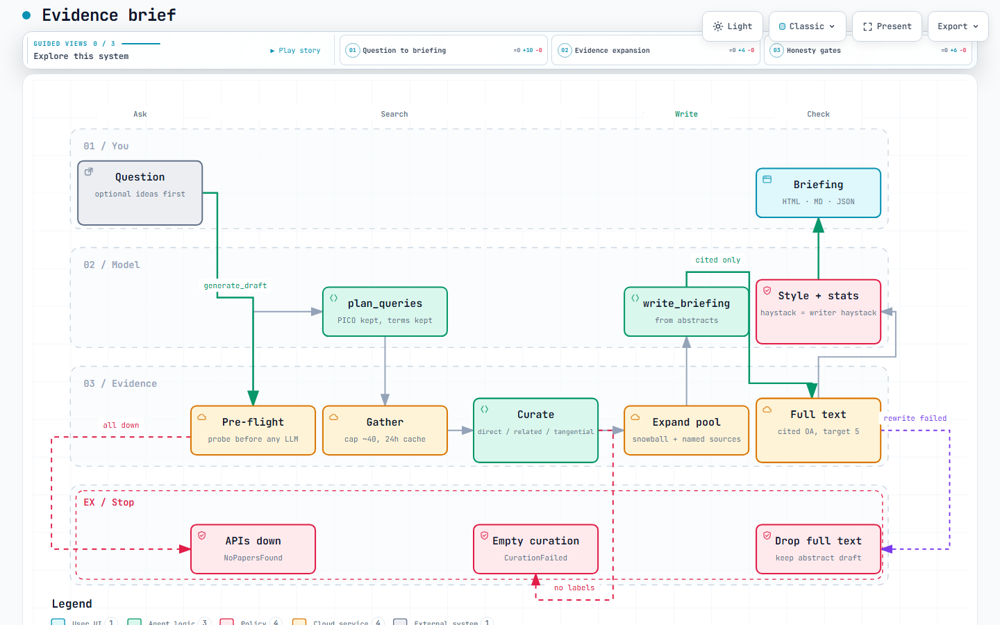

# Evidence brief

[](https://github.com/bartholomewtj/evidence-brief/actions/workflows/tests.yml)
[](https://github.com/bartholomewtj/evidence-brief/actions/workflows/health.yml)

Sourced evidence briefings from a question. Every statistic is checked against the cited papers.

One HTML page you can send: the question, what the evidence shows, what remains open, and three papers to open.

**[Open the site](https://bartholomewtj.github.io/evidence-brief/)** — free, no key. The CLI command is still `articlegen`.

## Run it

On the site: type a theme, pick a question, wait.

On your machine:

```bash
pip install -e .
export OPENROUTER_API_KEY=...           # or ANTHROPIC_API_KEY, or --model cli:opus
export SEMANTIC_SCHOLAR_API_KEY=...     # free; without it that database is skipped

articlegen ideas "seclusion reduction in acute psychiatric wards"
articlegen draft "Does reducing seclusion on acute psychiatric wards increase violence?" --open
```

The site and the CLI run the same function. A draft writes `drafts/<date>-<slug>.html`, `.md`, and `.json`.

CLI default is Claude Opus 5 via OpenRouter (~50c–$1). The public site writes with GPT-5.6 Luna on the host's key. `--model openai/gpt-5.6-luna` is the cheap CLI option.

## How a briefing is made

You pick the question. Everything between that and the page is `generate_draft()` in `articlegen/pipeline.py` — one copy, used by both the site and the CLI.

[](https://bartholomewtj.github.io/evidence-brief/docs/pipeline.html)

*[Open the interactive diagram](https://bartholomewtj.github.io/evidence-brief/docs/pipeline.html)* — pan, zoom, and three views: the happy path, how the paper pool grows, and where a run stops.

1. **Pre-flight.** Probe the scholarly APIs. If every source is down, stop before the first paid model call.
2. **Plan queries.** The model turns the question into 2–4 search strings. Terms from the idea card are kept, not replaced. PICO fields (population, intervention, comparator, outcome) reach the planner and the curator.
3. **Search.** Semantic Scholar, OpenAlex, Europe PMC, arXiv. Abstracts only at this stage. Deduped, ranked, capped at about 40. arXiv is queried last so a journal version wins over its preprint.
4. **Label.** Each paper is `direct`, `related`, or `tangential`. Empty labels stop the run — no writing, no full text. Retracted records never reach the writer; Methods names them.
5. **Widen the pool.** One hop through the reference lists of the top direct reviews, plus landmark papers named in those abstracts. New records are labelled too, so they can be read in full later.
6. **Write from abstracts.** A structured briefing. Cite at most `min(12, direct + 2)` sources, never fewer than 5 unless the pool is smaller.
7. **Read cited full text.** Open-access copies of cited *direct/related* sources only, design-weighted, up to 5 (the excerpt budget). Then rewrite once with those texts. If the rewrite fails, drop the full text so Methods cannot claim a read the prose never saw.
8. **Check the prose.** Deterministic journal-register rules (voice, hedging, no "clearly"/proof claims). Failed drafts go back to the model only while errors drop — at most two passes.
9. **Check the figures.** Every number is searched in exactly the abstracts and excerpts the writer was shown. Flagged figures buy one revision. Leftover misses are marked inline. This is the only gate that flags an article.
10. **Render.** HTML + Markdown + a JSON manifest of everything the run knew. Methods names only databases that actually answered. Table 1 is built from the records, not the model.

Two human gates: pick the question, read the page. Nothing in between asks you.

`--long` still writes the parked journal-style Review. Same pipeline, different shape.

## What the page is

| Block | Who writes it |
|---|---|
| Title (the question), one-paragraph answer, 5–8 findings, unknowns, three papers to open | the model, from the papers it was shown |
| Superscript Vancouver citations, reference list with DOIs | numbered from the records |
| **Methods** — search actually run, how deeply each source was read, which bits were model vs deterministic | derived from the run, never hardcoded |
| **Table 1** — design, n, registration, funding, relevance, read depth | the records |
| **Fig. 1** — study designs in the cited set | the records |
| Masthead: not peer reviewed; machine-written | fixed |

Treat it as a sourced starting point. Follow the links.

## What this will not do

- Invent journals, volumes, DOIs, or affiliations
- Let the writer see full text of papers it did not cite
- Claim a database was searched if it refused
- Quietly substitute adjacent literature when direct evidence is thin — the labels are there so the page can say so
- Instruct a clinician. Clinical topics carry a "not medical advice" line
- Auto-queue paywalled cites for a library download. They are logged, not queued

## After a run

```bash
articlegen render drafts/x.json     # rebuild HTML/Markdown, no search, no model
articlegen rerun drafts/x.json      # same pool and labels; fetch full text again; rewrite
articlegen refresh drafts/x.json    # re-run the same queries; report new direct records
```

`refresh --rewrite` only writes a new briefing if it found a new *direct* paper.

## Tests

```bash
python tests/test_offline.py
python tests/test_journal_conformance.py
python tests/test_replays.py
```

Run them as scripts, the way CI does. `tests/replays/` holds real run manifests — do not edit them.
